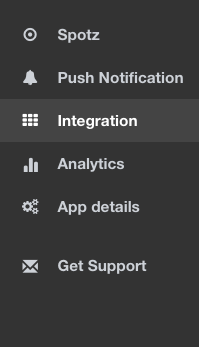
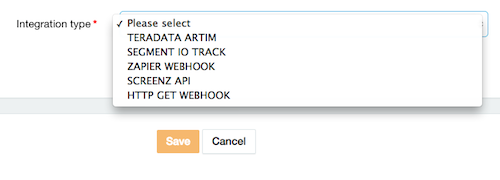
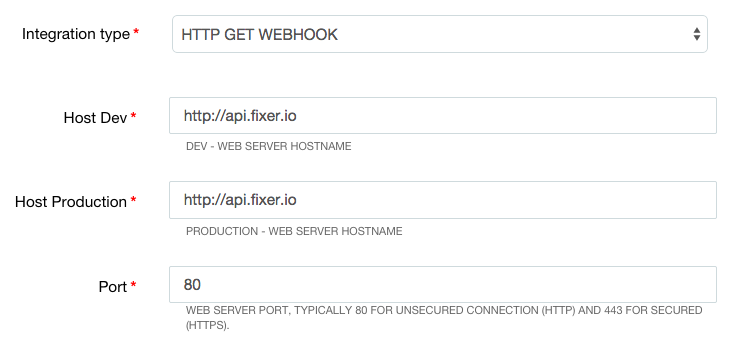
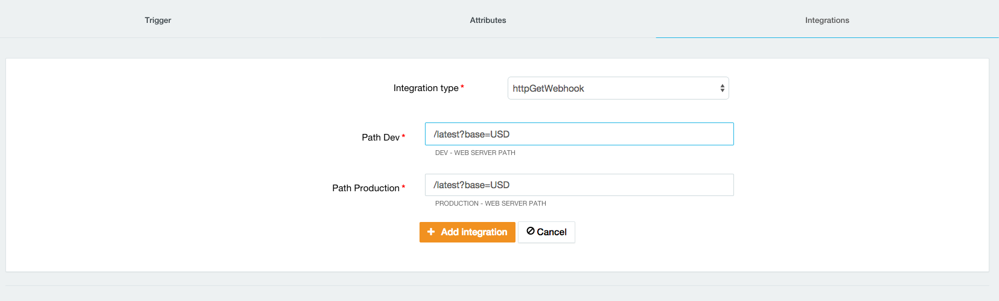

Spotz Integration Guide
=======================

### Intorduction

Localz Spotz platform allows developers efortlessly integrate microlocation into their mobile applications. 
This involves 3 steps:
 
 - setup locations you interested in on Spotz console
 - init spotz in your mobile application
 - act on spotz notification when you reach one of the locations

In third step, developer often need to contact 3rd part APIs to obtain location specific information (e.g. get promotion code relevant to the supermarket location) or to report fact of user comming to the location. Spotz platform includes integration framework. Using this framework, this call can be made without writing any single line of code. In fact, any number of 3rd party APIs could be called on demand, after application is in production. 
If you interested, read below.

### Spotz integration - high level view

As shown on sequence diagram below, Spotz platform will call 3rd party system, when spot is discovered and, if required, provide result back to your application.

Deloper chooses integrations on Spotz Web Console. As soon as integration assigned to a spot, it will be called any time a device reaches this spot. Hence you can turn on and off any of third party calls any time!

### Spotz integration - supported 3rd party systems

Integration with the following 3rd party systems supported:

- Teradata ARTIM(Aprimo Real Time Interaction manager) is part of Teradata <a href=\"http://marketing.teradata.com\"> Marketing Solution suite. </a> Using teradata ARTIM your application can receive personalised offers and promitions.
- "<a href=\"https://segment.com\">Segment</a> is cloud platform for collecting, transating and routing customer data. Segment integrated with large number of system, where this data can be analysed and visualied. 
- <a href=\"http://zapier.com\">Zapier</a> enables you to automate tasks between other online services. There are two basic principles to Zapier: a trigger, then an action.You can use an even of entering a spot as a trigger event in Zapier (webhook).
- Screenz-API is a Localz-developed extension for managing location-aware interactive screens. Intended to provide customers with a personalised experience through screens which respond to the customer’s proximity to the screen.

- HTTP GET WEBHOOK Use this extension to retrieve (HTTP GET) json data from an URL of your choice when user enters a spot.

The list expected to grow.
 
### Spotz integration - Tutorial

In this tutorial we will extend [Spotz test application](https://github.com/localz/spotz-sdk-android) by adding call to 3rd party server. 

#### Create Applicatiion - setup Integration

 - First login to [Spotz web console](spotz.localz.com) and create an application. Record <b> Application ID </b> and <b>Client Key</b> for the mobile platform of your choice.
 
 - Choose <b> Integration </b> Left menu item. <b> + Create new integration</b> and choose <b> HTTP GET WEBHOOK </b>.

  
 
 - Populate <b>http://api.fixer.io</b> into both <b> Host Dev</b> and <b> Host Production </b> text fields and type <b> 80 </b> into <b> Port</b> field.

  
 
 - Click Update.
  
 You have just added and integration to your application. You provided URL and port of the integration. At this stage nothing will be called, as you need to add this integration to some spots. 
 
#### Create Spotz - setup Integration

- Choose <b> Spotz </b> Left menu item.
- Create Spot if required
- Click <b> Edit </b> spot and then select <b> Integrations </b> tab
- Populate <b>/latest?base=USD</b> into both <b> Path Dev</b> and <b> Path Production </b> text fields. Press <b> + Add Integration </b> button. And then <b> Update </b> button to save the spot.

 

You have just configured the Spotz platform to call the Webhook to get exchange rates for USD when device detects the spot. Easy? About the same amount effort required to configure any other extension. The only thing left is handle response in the mobile app. 

#### Write client code - pass identities, receive integration response

- Following instructions for [Android](https://github.com/localz/spotz-sdk-android) or [iOS](https://github.com/localz/Spotz-iOS-SDK) to create test Spotz application. 
- When you run the app and discover the spot, the web server http://api.fixer.io/latest?base=USD. Now you only need to hadle response from the webserver. The instructions are mobile platform specific and corresponding Readme files have the details. 

As a bonus, try to register two spots and get AUD exchange rates for different spot. 
As another bonus, add [Zapier Webhook](https://zapier.com/zapbook/webhook/) to your application and spot. Try to send email to yourself whenever you detect the spot. Include some spotz information, e.g. spotz metadata and also name of the person using the app - you will need to pass identity when initialising Spotz. 

     